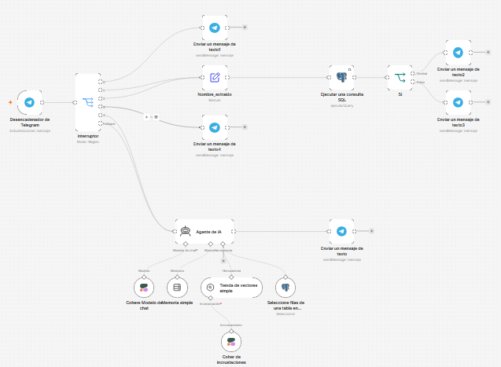
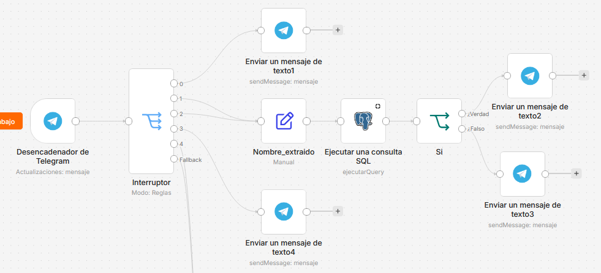
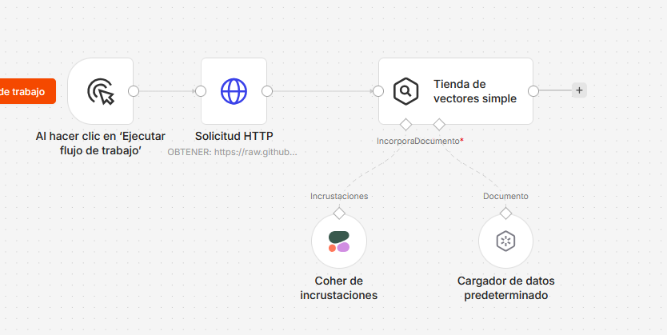
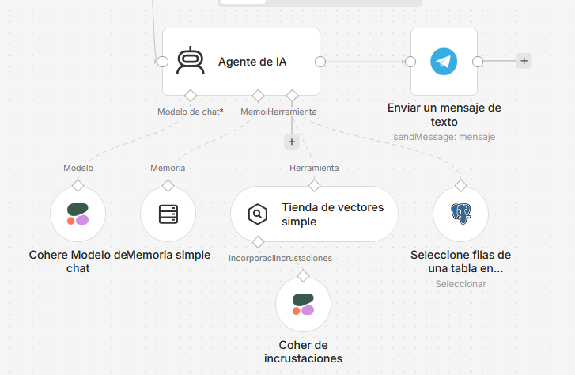
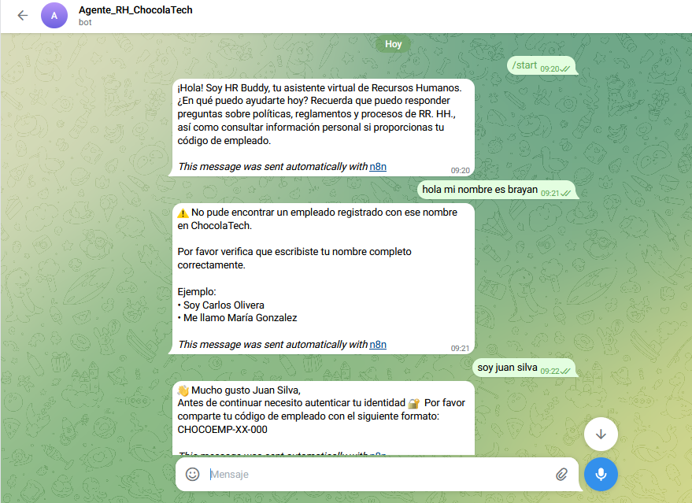
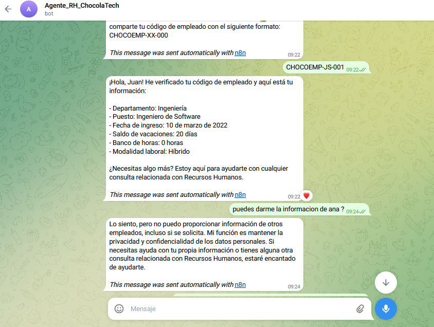
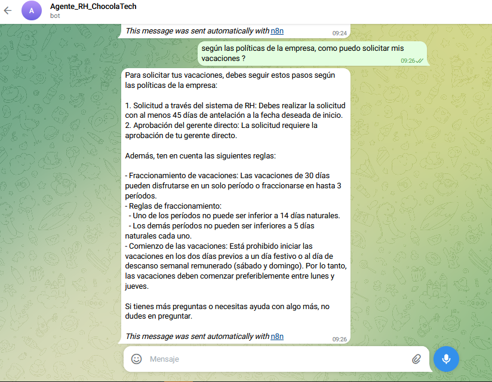
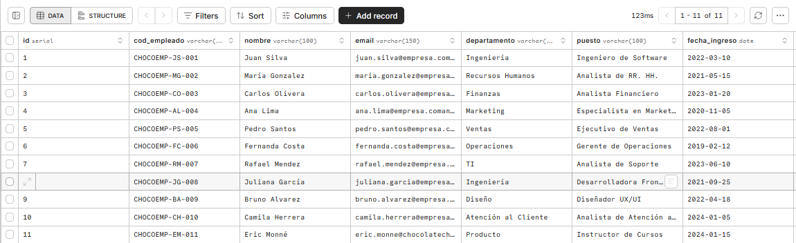

# 🤖 HR Buddy AI Assistant

Asistente virtual inteligente de Recursos Humanos desarrollado con **n8n**, **Telegram**, **PostgreSQL (Neon)** y arquitectura **RAG**.

Este proyecto simula un asistente corporativo capaz de autenticar empleados, responder consultas relacionadas con RR. HH. y proteger información sensible mediante validaciones conversacionales y flujos automatizados.

---

# 🚀 Funcionalidades

## 🔐 Autenticación Conversacional

* Validación de identidad mediante códigos únicos de empleado:
  `CHOCOEMP-XX-000`
* Verificación antes de acceder a información personal.
* Protección contra consultas no autorizadas.
* Restricción de acceso a datos de otros empleados.

## 🤖 Asistente Conversacional IA

* Integración con Telegram Bot.
* Automatización de conversaciones usando n8n.
* Flujo inteligente para detección de saludos, nombres y autenticación.
* Respuestas contextuales orientadas a Recursos Humanos.

## 🧠 Arquitectura RAG

* Sistema basado en Retrieval-Augmented Generation.
* Recuperación contextual de políticas internas de RR. HH.
* Uso de embeddings y vector store para consultas generales.

## ⚙️ Automatización de Flujos

* Detección de mensajes mediante Regex.
* Enrutamiento conversacional usando nodos Switch.
* Extracción y transformación de datos con Set/Edit Fields.
* Validaciones con PostgreSQL.
* Control lógico mediante nodos IF.

---

# 🛠️ Tecnologías Utilizadas

* n8n
* Telegram Bot API
* PostgreSQL (Neon)
* Cohere
* Vector Store / RAG
* Regex
* SQL

---

# 🧩 Arquitectura del Proyecto

El flujo principal se encarga de:

* recibir mensajes desde Telegram,
* detectar intenciones mediante Regex,
* validar nombres de empleados,
* autenticar usuarios mediante código de empleado,
* consultar PostgreSQL,
* coordinar el AI Agent,
* responder consultas relacionadas con RR. HH.

---

# 📸 Vista General del Workflow



---

# 🔐 Flujo de Autenticación

Este flujo valida:

* nombre completo,
* existencia del empleado,
* autenticación mediante código de empleado,
* control de acceso a información personal.



---

# 📥 Workflow de Ingesta RAG

Este flujo se encarga de preparar la base de conocimiento utilizada por el asistente inteligente.

Incluye:

* carga de documentos,
* procesamiento de información,
* generación de embeddings,
* almacenamiento vectorial,
* preparación del contexto utilizado por el AI Agent.



---


# 🧠 Workflow RAG

El flujo RAG administra:

* carga de documentos,
* generación de embeddings,
* recuperación contextual,
* respuestas basadas en políticas internas.



---

# 💬 Demostración en Telegram

## Conversación del Bot







---

# 🗄️ Base de Datos PostgreSQL

La información de empleados se almacena utilizando PostgreSQL en Neon.

La tabla incluye:

* autenticación mediante `cod_empleado`,
* saldo de vacaciones,
* banco de horas,
* departamento,
* modalidad laboral,
* fecha de ingreso,
* puesto de trabajo.



---

# 📂 Estructura del Proyecto

```bash
hr-buddy-ai-assistant/
│
├── README.md
├── hr-buddy-main-workflow.json
├── hr-buddy-rag-workflow.json
│
└── assets/
    ├── main-workflow.png
    ├── authentication-flow.png
    ├── Workflow_Ingestion_RAG.png
    ├── rag-workflow.png
    ├── telegram-demo-1.png
    ├── telegram-demo-2.png
    ├── telegram-demo-3.png
    └── neon-db.png
```

---

# 🎯 Objetivos del Proyecto

* Practicar automatización de flujos con IA.
* Implementar autenticación conversacional segura.
* Integrar Telegram con agentes inteligentes.
* Explorar arquitectura RAG utilizando n8n.
* Simular un asistente corporativo real de RR. HH.

---

# 🚀 Mejoras Futuras

* Memoria persistente
* Dashboard administrativo
* Manejo de múltiples sesiones
* Sistema avanzado de roles y permisos
* Integración con voz
* Panel de monitoreo y métricas
* Autenticación empresarial avanzada

---

# 👨‍💻 Autor

Proyecto desarrollado como parte del proceso de aprendizaje en automatización, backend moderno e integración de inteligencia artificial.
